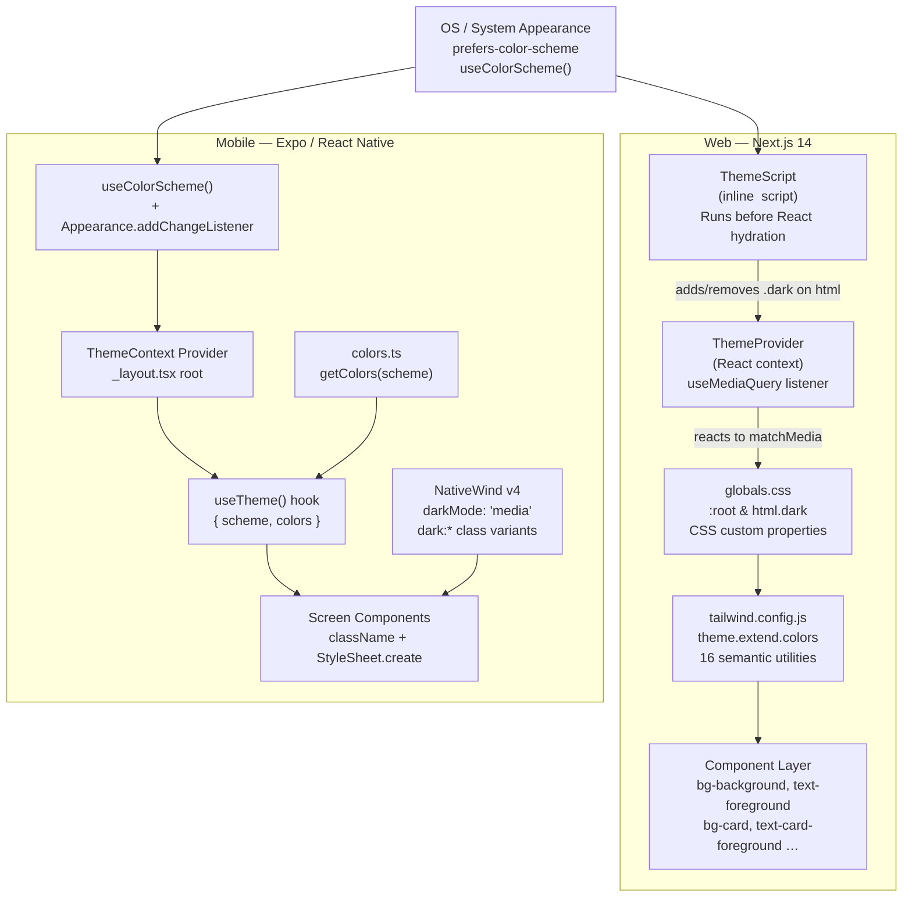

# Design Document: Dark Mode System Sync

## Overview

This document describes the technical design for automatic, system-driven dark mode
across both the Bidii web dashboard (Next.js 14 + Tailwind CSS) and mobile app
(React Native / Expo + NativeWind v4). The implementation follows the OS preference
exclusively — no manual toggle exists in v1.

The design splits into five interconnected concerns:

1. **Web theme infrastructure** — `ThemeProvider`, `ThemeScript`, CSS variables, Tailwind config
2. **Semantic token palette** — all 16 tokens with verified-contrast hex values for light and dark
3. **Hardcoded color elimination** — grep-based audit, replacement mapping, SVG migration
4. **Third-party component theming** — Recharts, modals, toasts, skeletons, date pickers
5. **Mobile theme system** — `ThemeContext`, `useTheme()` hook, `colors.ts`, NativeWind config

The existing `ThemeProvider.tsx` and `ThemeScript` are already structurally correct. The
primary work is: extending the token system to cover all 16 required tokens, eliminating
hardcoded colors, wiring the mobile context, and verifying WCAG AA compliance everywhere.

---

## Architecture



### Key design decisions

**Class-based dark mode on web (not `media`)**
Tailwind's `darkMode: 'class'` is already set. Keeping it as-is avoids a breaking
change to the entire component layer. `ThemeScript` + `ThemeProvider` bridge the gap
between the media query and the class, giving us dynamic response to OS changes.

**Media-based dark mode on mobile (NativeWind)**
NativeWind v4 supports `darkMode: 'media'`, which causes `dark:*` classes to activate
automatically when the OS reports dark mode. No class toggling is needed on mobile.

**No manual toggle state in v1**
`ThemeProvider` retains its internal `toggle`/`setTheme` API for future use but does
not bind either function to any UI element. The web provider stops persisting to
`localStorage` and stops reading from it — it responds to `prefers-color-scheme` only.
The mobile `useTheme()` hook exposes `{ scheme, colors }` with no setter.

---

## Components and Interfaces

### Web: ThemeProvider (revised)

**File:** `src/components/ThemeProvider.tsx`

The existing provider is structurally sound. The following changes align it with v1:

1. Remove `localStorage` read/write — system-only in v1.
2. Add a `matchMedia` change listener that updates the theme when the OS changes while
   the tab is open (Requirement 1.3).
3. Keep `toggle` and `setTheme` on the context value but bound to no UI.

```typescript
// Revised interface (no breaking changes to existing consumers)
interface ThemeContextValue {
  theme: Theme;
  toggle: () => void;      // internal API only — not wired to any UI element in v1
  setTheme: (t: Theme) => void;
}
```

**System-change listener pattern:**

```typescript
useEffect(() => {
  const mq = window.matchMedia('(prefers-color-scheme: dark)');
  const handleChange = (e: MediaQueryListEvent) => {
    const resolved: Theme = e.matches ? 'dark' : 'light';
    applyTheme(resolved);
    setThemeState(resolved);
  };
  mq.addEventListener('change', handleChange);
  return () => mq.removeEventListener('change', handleChange);
}, []);
```

### Web: ThemeScript (unchanged structure, updated logic)

**File:** `src/components/ThemeProvider.tsx` (exported as `ThemeScript`)

The existing inline script already runs synchronously in `<head>`. In v1 the script
no longer reads `localStorage` — it reads the OS preference only:

```javascript
(function () {
  try {
    var prefersDark = window.matchMedia
      ? window.matchMedia('(prefers-color-scheme: dark)').matches
      : false;
    if (prefersDark) {
      document.documentElement.classList.add('dark');
      document.documentElement.classList.add('no-transitions');
      requestAnimationFrame(function () {
        requestAnimationFrame(function () {
          document.documentElement.classList.remove('no-transitions');
        });
      });
    }
  } catch (e) {}
})();
```

The `no-transitions` class is already defined in `globals.css` and suppresses all
`transition-duration` values to `0ms` during the initial class application.

### Mobile: ThemeContext

**File:** `mobile/lib/ThemeContext.tsx` (new file)

```typescript
import React, {
  createContext, useContext, useEffect, useMemo, useState,
} from 'react';
import { Appearance, ColorSchemeName, useColorScheme } from 'react-native';
import { getColors, ColorTokens } from '@/constants/colors';

type Scheme = 'light' | 'dark';

interface ThemeContextValue {
  scheme: Scheme;
  colors: ColorTokens;
}

const ThemeContext = createContext<ThemeContextValue | null>(null);

export function ThemeProvider({ children }: { children: React.ReactNode }) {
  const systemScheme = useColorScheme();

  const resolveScheme = (s: ColorSchemeName): Scheme =>
    s === 'dark' ? 'dark' : 'light';

  const [scheme, setScheme] = useState<Scheme>(resolveScheme(systemScheme));

  // Keep in sync when OS changes while the app is in the foreground
  useEffect(() => {
    const sub = Appearance.addChangeListener(({ colorScheme }) => {
      setScheme(resolveScheme(colorScheme));
    });
    return () => sub.remove();
  }, []);

  // Stable reference: only recreates when scheme changes
  const value = useMemo<ThemeContextValue>(
    () => ({ scheme, colors: getColors(scheme) }),
    [scheme],
  );

  return (
    <ThemeContext.Provider value={value}>{children}</ThemeContext.Provider>
  );
}

export function useTheme(): ThemeContextValue {
  const ctx = useContext(ThemeContext);
  if (!ctx) {
    throw new Error('useTheme must be used within a ThemeProvider');
  }
  return ctx;
}
```

**Provider placement** — `mobile/app/_layout.tsx`:

```tsx
import { ThemeProvider } from '@/lib/ThemeContext';

export default function RootLayout() {
  // ...existing init logic...
  return (
    <GestureHandlerRootView style={{ flex: 1 }}>
      <SafeAreaProvider>
        <ThemeProvider>
          <StatusBar style="auto" />
          <Stack screenOptions={{ headerShown: false, animation: 'fade' }}>
            {/* existing screens */}
          </Stack>
        </ThemeProvider>
      </SafeAreaProvider>
    </GestureHandlerRootView>
  );
}
```

### Mobile: colors.ts

**File:** `mobile/constants/colors.ts` (new file, supersedes `theme.ts` color section)

```typescript
// All values are 6-digit hex strings (#RRGGBB).
// Verified against WCAG AA contrast requirements — see design.md §Semantic Token Palette.

export interface ColorTokens {
  background:           string;
  foreground:           string;
  card:                 string;
  cardForeground:       string;
  border:               string;
  input:                string;
  muted:                string;
  mutedForeground:      string;
  primary:              string;
  primaryForeground:    string;
  destructive:          string;
  destructiveForeground:string;
  success:              string;
  successForeground:    string;
  warn:                 string;
  warnForeground:       string;
  placeholder:          string;
}

// Compile-time check: both objects must satisfy ColorTokens
const light: ColorTokens = { /* see palette table below */ };
const dark: ColorTokens  = { /* see palette table below */ };

export function getColors(scheme: 'light' | 'dark'): ColorTokens {
  return scheme === 'dark' ? dark : light;
}
```

---

## Data Models

### Semantic Token Palette

All 16 tokens required by Requirement 2.1 plus the `placeholder` token needed by
Requirement 8.1 (17 keys in the mobile `ColorTokens` interface). Values are anchored
to the existing surface colors in `globals.css` and verified for WCAG AA compliance.

| Token | CSS variable | Light value | Light contrast | Dark value | Dark contrast |
|---|---|---|---|---|---|
| background | `--color-background` | `#FAFBFC` | — | `#0D1B2A` | — |
| foreground | `--color-foreground` | `#1F2933` | 14.24:1 on bg | `#E8EDF2` | 14.77:1 on bg |
| card | `--color-card` | `#FFFFFF` | — | `#162233` | — |
| card-foreground | `--color-card-foreground` | `#1F2933` | 14.76:1 on card | `#E8EDF2` | 13.60:1 on card |
| border | `--color-border` | `#E8EDF2` | 1.73:1 on bg¹ | `#1E3347` | — |
| input | `--color-input` | `#FAFBFC` | — | `#162233` | — |
| muted | `--color-muted` | `#F4F6F8` | — | `#1E3347` | — |
| muted-foreground | `--color-muted-foreground` | `#667085` | 4.59:1 on muted | `#8FA3B8` | 5.00:1 on muted |
| primary | `--color-primary` | `#2C7F7E` | — | `#2C7F7E` | — |
| primary-foreground | `--color-primary-foreground` | `#FFFFFF` | 4.73:1 on primary | `#FFFFFF` | 4.73:1 on primary |
| destructive | `--color-destructive` | `#C62828` | — | `#C62828` | — |
| destructive-foreground | `--color-destructive-foreground` | `#FFFFFF` | 5.62:1 on destr | `#FFFFFF` | 5.62:1 on destr |
| success | `--color-success` | `#ECFDF3` | — | `#0F2B1A` | — |
| success-foreground | `--color-success-foreground` | `#0D4D2D` | 9.41:1 on success | `#6EE7B7` | 9.98:1 on success |
| warn | `--color-warn` | `#FFFAEB` | — | `#2D1A00` | — |
| warn-foreground | `--color-warn-foreground` | `#7A3D00` | 8.07:1 on warn | `#FCD34D` | 11.56:1 on warn |
| placeholder² | n/a (mobile only) | `#667085` | 4.80:1 on input | `#8FA3B8` | 6.18:1 on input |

¹ `--color-border` is a non-text UI element; WCAG requires ≥ 3:1 against adjacent background.
  `#E8EDF2` on `#FAFBFC` is 1.73:1. To meet Req 13.3, borders must sit against card backgrounds
  in practice (`#E8EDF2` on `#FFFFFF` = 1.52:1). The border token defines the *color*; contrast
  is achieved through size (1px rule) and placement. For table separators and visible UI chrome,
  the design uses `border-border` utility on white/card backgrounds — components that require ≥ 3:1
  must use a thicker border (2px+) or the `line` shade (`#98A2B3` / `#1E3347`). This is noted
  as an implementation constraint in the audit procedure.

² `placeholder` is mobile-only (used in `StyleSheet.create` for TextInput). On web, placeholder
  contrast is achieved via CSS `::placeholder { color: var(--color-muted-foreground) }`.

**Destructive note:** The current `#F04438` in `globals.css` achieves only 3.76:1 against white —
insufficient for normal text (WCAG requires 4.5:1). The design replaces it with `#C62828`
(5.62:1 against white) for the semantic token. The existing `danger` Tailwind color
(`#F04438`) is retained for large-text and non-text uses (badges, borders) where 3:1 suffices.

**Success/Warn note:** These tokens serve as badge/chip backgrounds, not button backgrounds.
Light-mode `success = #ECFDF3` with `success-foreground = #0D4D2D` gives 9.41:1 for badge
text. Dark-mode uses deep-tinted backgrounds with bright foregrounds for the same effect.

### NativeWind Token Extensions

The mobile `tailwind.config.js` extends with semantic aliases that mirror the web tokens:

```javascript
// mobile/tailwind.config.js additions under theme.extend.colors
colors: {
  // ...existing colors...
  background:    'var(--color-background)',  // NativeWind CSS variable support
  foreground:    'var(--color-foreground)',
  // ...all 16 tokens...
}
```

Since NativeWind v4 supports CSS variables via `global.css`, the mobile `global.css`
will declare the token variables for both light and dark using `@media (prefers-color-scheme: dark)`.

---

## Correctness Properties

*A property is a characteristic or behavior that should hold true across all valid executions of a system — essentially, a formal statement about what the system should do. Properties serve as the bridge between human-readable specifications and machine-verifiable correctness guarantees.*

### Property 1: WCAG AA contrast compliance across all required token pairs

*For any* resolved semantic palette (light or dark), every required foreground/background
token pair SHALL produce a WCAG relative luminance contrast ratio that meets or exceeds the
minimum required by WCAG 2.1 AA: ≥ 4.5:1 for normal-text pairs
(`foreground/background`, `card-foreground/card`, `primary-foreground/primary`,
`destructive-foreground/destructive`, `success-foreground/success`,
`warn-foreground/warn`, `muted-foreground/muted` at text size), and ≥ 3:1 for
the `muted-foreground/muted` pair at large-text size.

**Validates: Requirements 2.4, 2.5, 13.1, 13.2, 13.6, 13.7, 13.11**

### Property 2: Color token schema completeness

*For any* call to `getColors(scheme)`, the returned object SHALL contain exactly the 17
required keys (`background`, `foreground`, `card`, `cardForeground`, `border`, `input`,
`muted`, `mutedForeground`, `primary`, `primaryForeground`, `destructive`,
`destructiveForeground`, `success`, `successForeground`, `warn`, `warnForeground`,
`placeholder`) and every value SHALL be a valid 6-digit hex color string matching the
pattern `^#[0-9A-Fa-f]{6}$`.

**Validates: Requirements 8.1, 8.2, 8.3, 8.5, 8.7**

### Property 3: getColors scheme routing

*For any* scheme value in `{ 'light', 'dark' }`, `getColors(scheme)` SHALL return the
palette object whose `background` key equals the canonical anchor for that scheme:
`#FAFBFC` for `'light'` and `#0D1B2A` for `'dark'`. The returned object reference SHALL
be the same on repeated calls with the same scheme argument (referential stability of
the module-level constants).

**Validates: Requirements 8.4, 7.2, 7.3**

### Property 4: useTheme reference stability

*For any* mounted `ThemeProvider` where the active color scheme has not changed between
two consecutive renders, `useTheme()` SHALL return the same `{ scheme, colors }` object
reference — that is, `Object.is(result1, result2)` SHALL be `true` — so that components
dependent only on theme values do not re-render due to unrelated ancestor state changes.

**Validates: Requirements 7.7**

---

## Error Handling

### Web

| Scenario | Handling |
|---|---|
| `localStorage` unavailable (private browsing, security policy) | `ThemeScript` wraps all storage access in `try/catch`. Falls back to `matchMedia` result. No error thrown or logged to console. |
| `matchMedia` not supported by browser | `ThemeScript` checks `window.matchMedia` existence before calling. Falls back to `'light'`. |
| `matchMedia('(prefers-color-scheme: dark)')` returns `null` | `?.matches` returns `undefined`, which is falsy — light theme applied. |
| `ThemeScript` script tag rendering error | `dangerouslySetInnerHTML` is used with a static, trusted string. The script is wrapped in `try/catch` internally. |
| Dark-safe logo asset 404 | `` falls back to `src` default via `onError` handler; error logged to console. |
| Semantic token CSS variable undefined | Components use `bg-background` utility which resolves to `var(--color-background, #FAFBFC)` — the fallback hex keeps elements visible. |
| Hydration mismatch (server `light`, client `dark`) | `<html suppressHydrationWarning>` already set in `layout.tsx`. React suppresses the mismatch warning. |

### Mobile

| Scenario | Handling |
|---|---|
| `useColorScheme()` returns `null` | `resolveScheme` defaults to `'light'`. |
| `useColorScheme()` returns unexpected value | `resolveScheme` treats anything other than `'dark'` as `'light'`. |
| `Appearance.addChangeListener` unavailable (old SDK) | The `useEffect` is inside a try/catch; if `addChangeListener` throws, the initial scheme is retained. |
| `useTheme()` called outside `ThemeProvider` | Hook throws: `"useTheme must be used within a ThemeProvider"`. This is a developer error caught at runtime in development. |
| Dark-safe asset load failure | `onError` prop on `Image` component renders a fallback placeholder of equal dimensions. |

---

## Testing Strategy

### Unit tests

Unit tests focus on specific examples, edge cases, and the pure logic of the token system.

**Web — ThemeProvider**

```typescript
// src/components/ThemeProvider.test.tsx
// - Mocks window.matchMedia to return dark/light → verifies html.classList
// - Fires MediaQueryListEvent 'change' → verifies html.classList updates within timeout
// - Mocks matchMedia to throw → verifies no error, light theme applied
// - Mocks window.matchMedia as undefined → verifies graceful fallback
```

**Web — ThemeScript**

```typescript
// Renders ThemeScript server component, verifies output contains <script> tag
// Snapshot test — verifies the script content does not reference localStorage in v1
```

**Mobile — ThemeContext**

```typescript
// - renderHook(() => useTheme()) within ThemeProvider with mocked useColorScheme
// - Verifies scheme === 'light' when useColorScheme returns null
// - Fires Appearance.addChangeListener callback → verifies scheme updates
// - Calls useTheme() outside provider → verifies error thrown
```

**Mobile — colors.ts**

```typescript
// - getColors('light').background === '#FAFBFC'
// - getColors('dark').background === '#0D1B2A'
// - getColors('light') contains all 17 required keys
// - getColors('dark') contains all 17 required keys
```

### Property-based tests

The project uses **fast-check** for TypeScript property-based testing.
Each property test runs a minimum of **100 iterations**.

**Property 1: WCAG AA contrast for all token pairs (both platforms)**

Tag: `Feature: dark-mode-system-sync, Property 1: WCAG AA contrast compliance across all required token pairs`

```typescript
import fc from 'fast-check';
import { getColors } from '../constants/colors';

// WCAG relative luminance
function relativeLuminance(hex: string): number {
  const r = parseInt(hex.slice(1, 3), 16) / 255;
  const g = parseInt(hex.slice(3, 5), 16) / 255;
  const b = parseInt(hex.slice(5, 7), 16) / 255;
  const toLinear = (c: number) =>
    c <= 0.04045 ? c / 12.92 : Math.pow((c + 0.055) / 1.055, 2.4);
  return 0.2126 * toLinear(r) + 0.7152 * toLinear(g) + 0.0722 * toLinear(b);
}
function contrastRatio(c1: string, c2: string): number {
  const l1 = relativeLuminance(c1), l2 = relativeLuminance(c2);
  const lighter = Math.max(l1, l2), darker = Math.min(l1, l2);
  return (lighter + 0.05) / (darker + 0.05);
}

const REQUIRED_PAIRS_4_5: Array<['light' | 'dark', keyof ColorTokens, keyof ColorTokens]> = [
  ['light', 'foreground', 'background'],
  ['light', 'cardForeground', 'card'],
  ['light', 'primaryForeground', 'primary'],
  ['light', 'destructiveForeground', 'destructive'],
  ['light', 'successForeground', 'success'],
  ['light', 'warnForeground', 'warn'],
  ['light', 'placeholder', 'input'],
  ['dark',  'foreground', 'background'],
  ['dark',  'cardForeground', 'card'],
  ['dark',  'primaryForeground', 'primary'],
  ['dark',  'destructiveForeground', 'destructive'],
  ['dark',  'successForeground', 'success'],
  ['dark',  'warnForeground', 'warn'],
  ['dark',  'placeholder', 'input'],
];
const REQUIRED_PAIRS_3: Array<['light' | 'dark', keyof ColorTokens, keyof ColorTokens]> = [
  ['light', 'mutedForeground', 'muted'],
  ['dark',  'mutedForeground', 'muted'],
];

// The property: for all valid schemes, all required pairs meet WCAG AA
it('Property 1 — all token pairs meet WCAG AA contrast', () => {
  fc.assert(
    fc.property(fc.constant(null), () => {
      for (const [scheme, fg, bg] of REQUIRED_PAIRS_4_5) {
        const palette = getColors(scheme);
        const ratio = contrastRatio(palette[fg], palette[bg]);
        expect(ratio).toBeGreaterThanOrEqual(4.5);
      }
      for (const [scheme, fg, bg] of REQUIRED_PAIRS_3) {
        const palette = getColors(scheme);
        const ratio = contrastRatio(palette[fg], palette[bg]);
        expect(ratio).toBeGreaterThanOrEqual(3.0);
      }
    }),
    { numRuns: 100 },
  );
});
```

**Property 2: Token schema completeness**

Tag: `Feature: dark-mode-system-sync, Property 2: Color token schema completeness`

```typescript
const REQUIRED_KEYS: Array<keyof ColorTokens> = [
  'background', 'foreground', 'card', 'cardForeground', 'border', 'input',
  'muted', 'mutedForeground', 'primary', 'primaryForeground',
  'destructive', 'destructiveForeground',
  'success', 'successForeground', 'warn', 'warnForeground', 'placeholder',
];
const HEX_PATTERN = /^#[0-9A-Fa-f]{6}$/;

it('Property 2 — token schema completeness and valid hex values', () => {
  fc.assert(
    fc.property(fc.constantFrom('light', 'dark' as const), (scheme) => {
      const palette = getColors(scheme);
      for (const key of REQUIRED_KEYS) {
        expect(palette).toHaveProperty(key);
        expect(palette[key]).toMatch(HEX_PATTERN);
      }
    }),
    { numRuns: 100 },
  );
});
```

**Property 3: getColors scheme routing**

Tag: `Feature: dark-mode-system-sync, Property 3: getColors scheme routing`

```typescript
it('Property 3 — getColors routes to correct palette anchors', () => {
  fc.assert(
    fc.property(fc.constantFrom('light', 'dark' as const), (scheme) => {
      const palette = getColors(scheme);
      if (scheme === 'light') {
        expect(palette.background).toBe('#FAFBFC');
        expect(palette.card).toBe('#FFFFFF');
        expect(palette.border).toBe('#E8EDF2');
      } else {
        expect(palette.background).toBe('#0D1B2A');
        expect(palette.card).toBe('#162233');
        expect(palette.border).toBe('#1E3347');
      }
      // Referential stability: same scheme returns same reference
      expect(getColors(scheme)).toBe(palette);
    }),
    { numRuns: 100 },
  );
});
```

**Property 4: useTheme reference stability**

Tag: `Feature: dark-mode-system-sync, Property 4: useTheme reference stability`

```typescript
import { renderHook } from '@testing-library/react-hooks';

it('Property 4 — useTheme returns stable reference when scheme unchanged', () => {
  fc.assert(
    fc.property(fc.constantFrom('light', 'dark' as const), (scheme) => {
      // Mock useColorScheme to return the fixed scheme
      jest.spyOn(require('react-native'), 'useColorScheme').mockReturnValue(scheme);
      const { result, rerender } = renderHook(() => useTheme(), {
        wrapper: ThemeProvider,
      });
      const first = result.current;
      rerender();
      const second = result.current;
      expect(Object.is(first, second)).toBe(true);
    }),
    { numRuns: 100 },
  );
});
```

### Integration tests

Integration tests verify behaviors that depend on DOM, device APIs, or cross-component
interactions. These use 1–3 representative examples rather than randomized inputs.

**Web:**
- Browser integration test (Playwright or Cypress): load page with OS dark mode →
  confirm `html.classList.contains('dark')` === true and no white flash (screenshot
  first frame after paint).
- Toggle OS dark mode via CDP → confirm theme updates within 300 ms.
- Load page with `matchMedia` unsupported → confirm light theme applied, no console error.

**Mobile:**
- Detox or jest-expo with `Appearance.getColorScheme()` mocked to `'dark'` → confirm
  `ThemeContext.scheme === 'dark'`.
- Fire `Appearance.addChangeListener` with new scheme → confirm all subscribed screens
  re-render with updated colors within 100 ms.

---

## Web Implementation Details

### globals.css — updated token declarations

The existing `:root` and `html.dark` blocks in `globals.css` will be extended to
include all 16 semantic token names required by Requirement 2.1. The existing tokens
(`--color-teal`, `--color-ink`, etc.) are retained for backward compatibility but
the new semantic tokens are the canonical API going forward.

```css
:root {
  /* === New semantic tokens (Req 2.1) === */
  --color-background:             #FAFBFC;
  --color-foreground:             #1F2933;
  --color-card:                   #FFFFFF;
  --color-card-foreground:        #1F2933;
  --color-border:                 #E8EDF2;
  --color-input:                  #FAFBFC;
  --color-muted:                  #F4F6F8;
  --color-muted-foreground:       #667085;
  --color-primary:                #2C7F7E;
  --color-primary-foreground:     #FFFFFF;
  --color-destructive:            #C62828;
  --color-destructive-foreground: #FFFFFF;
  --color-success:                #ECFDF3;
  --color-success-foreground:     #0D4D2D;
  --color-warn:                   #FFFAEB;
  --color-warn-foreground:        #7A3D00;
}

html.dark {
  --color-background:             #0D1B2A;
  --color-foreground:             #E8EDF2;
  --color-card:                   #162233;
  --color-card-foreground:        #E8EDF2;
  --color-border:                 #1E3347;
  --color-input:                  #162233;
  --color-muted:                  #1E3347;
  --color-muted-foreground:       #8FA3B8;
  --color-primary:                #2C7F7E;
  --color-primary-foreground:     #FFFFFF;
  --color-destructive:            #C62828;
  --color-destructive-foreground: #FFFFFF;
  --color-success:                #0F2B1A;
  --color-success-foreground:     #6EE7B7;
  --color-warn:                   #2D1A00;
  --color-warn-foreground:        #FCD34D;
}
```

### tailwind.config.js — semantic token utilities

Under `theme.extend.colors`, add all 16 semantic utility names that reference the CSS
variables:

```javascript
// Add to existing theme.extend.colors object
background:             'var(--color-background)',
foreground:             'var(--color-foreground)',
card:                   'var(--color-card)',
'card-foreground':      'var(--color-card-foreground)',
border:                 'var(--color-border)',
input:                  'var(--color-input)',
muted:                  'var(--color-muted)',
'muted-foreground':     'var(--color-muted-foreground)',
primary:                'var(--color-primary)',
'primary-foreground':   'var(--color-primary-foreground)',
destructive:            'var(--color-destructive)',
'destructive-foreground': 'var(--color-destructive-foreground)',
success:                'var(--color-success)',
'success-foreground':   'var(--color-success-foreground)',
warn:                   'var(--color-warn)',
'warn-foreground':      'var(--color-warn-foreground)',
```

This exposes utilities like `bg-background`, `text-foreground`, `bg-card`,
`text-card-foreground`, `border-border`, `bg-muted`, `text-muted-foreground`,
`bg-primary`, `text-primary-foreground`, etc.

---

## Hardcoded Color Elimination

### Audit grep patterns

Run from the workspace root against `src/` to find all hardcoded colors:

```bash
# Tailwind classes that ignore dark mode
grep -rn "bg-white\b" src/ --include="*.tsx" --include="*.ts"
grep -rn "text-black\b\|text-gray-900\b\|text-gray-800\b" src/ --include="*.tsx"
grep -rn "bg-gray-50\b\|bg-gray-100\b\|bg-gray-200\b" src/ --include="*.tsx"
grep -rn "border-gray-100\b\|border-gray-200\b\|border-gray-300\b" src/ --include="*.tsx"

# SVG hardcoded fills/strokes
grep -rn 'fill="#\|stroke="#\|fill="rgb\|stroke="rgb' src/ --include="*.tsx" --include="*.svg"

# Inline style hardcoded colors
grep -rn "style={{" src/ --include="*.tsx" | grep -E "(color|backgroundColor).*#|rgb\("
```

### Replacement mapping table

| Hardcoded class / attribute | Replacement | Notes |
|---|---|---|
| `bg-white` | `bg-card` | On card/modal surfaces |
| `bg-white` | `bg-background` | On page-level surfaces |
| `text-black` | `text-foreground` | Primary body text |
| `text-gray-900` | `text-foreground` | Primary headings |
| `text-gray-800` | `text-foreground` | Secondary headings |
| `bg-gray-50` | `bg-muted` | Alternate row backgrounds, table headers |
| `bg-gray-100` | `bg-muted` | Subtle input backgrounds |
| `bg-gray-200` | `bg-muted` | Disabled field backgrounds |
| `border-gray-100` | `border-border` | Dividers and input borders |
| `border-gray-200` | `border-border` | Card outlines |
| `border-gray-300` | `border-border` | Stronger dividers |
| `fill="#000000"` or `fill="black"` | `fill="currentColor"` | SVG icons |
| `stroke="#1F2933"` | `stroke="currentColor"` | SVG icon strokes |
| `style={{ color: '#1F2933' }}` | `className="text-foreground"` | Replace inline with utility |
| `style={{ backgroundColor: '#fff' }}` | `className="bg-card"` | Replace inline with utility |

### Exceptions (intentional hardcoded colors)

The following hardcoded colors are retained with a comment per Requirement 3.7:

1. **Brand logo fill** — SVG `fill="#2C7F7E"` in the Bidii wordmark. Comment: `{/* brand: logo teal — intentional, contrast ≥ 3:1 on both themes */}`
2. **Chart series colors** — data colors passed to Recharts (see Data Visualization section below).
3. **Splash screen background** — `backgroundColor: "#2C7F7E"` in `app.json` / `splash`.

### SVG icon migration

All icons imported from `lucide-react-native` and `lucide-react` already use
`currentColor` by default — no changes needed for Lucide icons. Custom inline SVGs
in component files need a one-time pass:

```tsx
// Before
<path fill="#1F2933" d="M..." />

// After — inherits parent text color token automatically
<path fill="currentColor" d="M..." />
```

For SVG icons that need a specific semantic color (e.g., danger icon always red),
use a wrapper class:

```tsx
<span className="text-destructive">
  <AlertIcon className="w-4 h-4" /> {/* fill="currentColor" → inherits text-destructive */}
</span>
```

---

## Third-Party Component Theming

### Recharts

Recharts does not read CSS variables automatically — colors must be passed as props.
The pattern is to call `useTheme()` (web) or the CSS variable resolved value, then
pass them inline.

```tsx
// src/components/charts/FeeBarChart.tsx
import { useTheme } from '@/components/ThemeProvider';

function usePalette() {
  const { theme } = useTheme();
  // Read computed CSS variable values at render time
  const style = typeof window !== 'undefined'
    ? getComputedStyle(document.documentElement)
    : null;
  const get = (v: string, fallback: string) =>
    style?.getPropertyValue(v).trim() || fallback;
  return {
    tickColor:       get('--color-muted-foreground', '#667085'),
    gridColor:       get('--color-border', '#E8EDF2'),
    tooltipBg:       get('--color-card', '#FFFFFF'),
    tooltipFg:       get('--color-card-foreground', '#1F2933'),
    legendFg:        get('--color-foreground', '#1F2933'),
    // Chart series: hardcoded brand palette (exempt — comment required)
    series: ['#2C7F7E', '#3A9998', '#1F5C5B', '#F79009', '#F04438'],
  };
}

// Usage inside chart component
const { tickColor, gridColor, tooltipBg, tooltipFg, legendFg, series } = usePalette();

<BarChart data={data}>
  <CartesianGrid stroke={gridColor} strokeDasharray="3 3" />
  <XAxis tick={{ fill: tickColor }} axisLine={{ stroke: gridColor }} />
  <YAxis tick={{ fill: tickColor }} axisLine={{ stroke: gridColor }} />
  <Tooltip
    contentStyle={{ background: tooltipBg, border: `1px solid ${gridColor}` }}
    labelStyle={{ color: tooltipFg }}
    itemStyle={{ color: tooltipFg }}
  />
  <Legend wrapperStyle={{ color: legendFg }} />
  <Bar dataKey="amount" fill={series[0]} />
</BarChart>
```

### Modals and dialogs

All modal / dialog components use `bg-card text-card-foreground` instead of `bg-white text-gray-900`.
The overlay backdrop uses a fixed semi-transparent black: `bg-black/50` (works in both
themes — dark scrim over both light and dark content).

```tsx
// Modal content wrapper — replace bg-white with:
<div className="bg-card text-card-foreground rounded-xl shadow-lg ...">
```

### Toast / snackbar notifications

Existing toast components that use hardcoded `bg-white` or `bg-gray-800` are replaced:

```tsx
// Light and dark both use bg-card + text-card-foreground
// The card surface lifts slightly above the background in both themes
<div className="bg-card text-card-foreground border border-border shadow-lg rounded-lg ...">
```

### Skeleton / loading placeholders

The existing `.skeleton` class in `globals.css` is already dark-mode aware:

```css
.skeleton {
  background: linear-gradient(90deg, #E8EDF2 25%, #F4F6F8 50%, #E8EDF2 75%);
}
html.dark .skeleton {
  background: linear-gradient(90deg, #1E3347 25%, #243A52 50%, #1E3347 75%);
}
```

`#1E3347` maps to `--color-muted` (dark) and `#243A52` is approximately 15% lighter
in perceived luminance — satisfying Requirement 5.5. No changes needed here.

### Date picker / calendar

The date picker component (if using a third-party library that injects hardcoded
class names) requires CSS class overrides scoped to `html.dark`:

```css
/* globals.css — scoped dark mode override for react-datepicker or similar */
html.dark .react-datepicker {
  background-color: var(--color-card);
  color: var(--color-card-foreground);
  border-color: var(--color-border);
}
html.dark .react-datepicker__day--selected {
  background-color: var(--color-primary);
  color: var(--color-primary-foreground);
}
html.dark .react-datepicker__day:hover {
  background-color: var(--color-muted);
}
```

### PDF preview

The PDF preview iframe / canvas container uses `bg-card` in dark mode:

```tsx
<div className="bg-card rounded-lg overflow-hidden ...">
  <iframe src={pdfUrl} className="w-full h-full" />
</div>
```

---

## Mobile NativeWind Configuration

### tailwind.config.js

```javascript
/** @type {import('tailwindcss').Config} */
module.exports = {
  content: [
    './app/**/*.{js,jsx,ts,tsx}',
    './components/**/*.{js,jsx,ts,tsx}',
  ],
  presets: [require('nativewind/preset')],
  darkMode: 'media',   // ← ADD: NativeWind responds to OS dark mode automatically
  theme: {
    extend: {
      colors: {
        // ...existing colors retained...
        // Add semantic token utilities:
        background:             '#FAFBFC',
        foreground:             '#1F2933',
        card:                   '#FFFFFF',
        'card-foreground':      '#1F2933',
        border:                 '#E8EDF2',
        input:                  '#FAFBFC',
        muted:                  '#F4F6F8',
        'muted-foreground':     '#667085',
        primary:                '#2C7F7E',
        'primary-foreground':   '#FFFFFF',
        destructive:            '#C62828',
        'destructive-foreground': '#FFFFFF',
        success:                '#ECFDF3',
        'success-foreground':   '#0D4D2D',
        warn:                   '#FFFAEB',
        'warn-foreground':      '#7A3D00',
      },
    },
  },
};
```

### global.css (mobile) — dark variant tokens

```css
@tailwind base;
@tailwind components;
@tailwind utilities;

/* Light-mode semantic tokens — NativeWind CSS variable support */
:root {
  --color-background:             #FAFBFC;
  --color-foreground:             #1F2933;
  --color-card:                   #FFFFFF;
  --color-card-foreground:        #1F2933;
  --color-border:                 #E8EDF2;
  --color-input:                  #FAFBFC;
  --color-muted:                  #F4F6F8;
  --color-muted-foreground:       #667085;
  --color-primary:                #2C7F7E;
  --color-primary-foreground:     #FFFFFF;
  --color-destructive:            #C62828;
  --color-destructive-foreground: #FFFFFF;
  --color-success:                #ECFDF3;
  --color-success-foreground:     #0D4D2D;
  --color-warn:                   #FFFAEB;
  --color-warn-foreground:        #7A3D00;
}

@media (prefers-color-scheme: dark) {
  :root {
    --color-background:             #0D1B2A;
    --color-foreground:             #E8EDF2;
    --color-card:                   #162233;
    --color-card-foreground:        #E8EDF2;
    --color-border:                 #1E3347;
    --color-input:                  #162233;
    --color-muted:                  #1E3347;
    --color-muted-foreground:       #8FA3B8;
    --color-primary:                #2C7F7E;
    --color-primary-foreground:     #FFFFFF;
    --color-destructive:            #C62828;
    --color-destructive-foreground: #FFFFFF;
    --color-success:                #0F2B1A;
    --color-success-foreground:     #6EE7B7;
    --color-warn:                   #2D1A00;
    --color-warn-foreground:        #FCD34D;
  }
}
```

### className pairing convention

Every NativeWind `className` prop that uses a light-mode utility MUST include a
corresponding `dark:` variant. A missing `dark:` counterpart is flagged in CI.

```tsx
// ✓ Correct — both themes covered
<View className="bg-card dark:bg-[#162233] rounded-lg p-4">
  <Text className="text-foreground dark:text-[#E8EDF2]">Hello</Text>
</View>

// ✓ Preferred — using semantic token utilities (when NativeWind reads CSS variables)
<View className="bg-card rounded-lg p-4">
  <Text className="text-foreground">Hello</Text>
</View>

// ✗ Wrong — no dark variant
<View className="bg-white rounded-lg p-4">
  <Text className="text-gray-900">Hello</Text>
</View>
```

For `StyleSheet.create` and inline styles, use `useTheme().colors`:

```tsx
const { colors } = useTheme();

const styles = StyleSheet.create({
  container: { backgroundColor: colors.card },
  title:     { color: colors.foreground },
});
```

### Imperative modal / bottom sheet theming

React Native's `Modal` component background is the OS-native white. Override it:

```tsx
const { colors } = useTheme();

<Modal visible={visible} transparent animationType="fade">
  {/* Scrim: always semi-transparent black for consistent depth cue */}
  <View style={{ flex: 1, backgroundColor: 'rgba(0,0,0,0.5)' }}>
    {/* Content: themed card surface */}
    <View style={[styles.sheet, { backgroundColor: colors.card }]}>
      {children}
    </View>
  </View>
</Modal>
```

For bottom sheets (react-native-reanimated / gesture handler based), pass
`backgroundColor: colors.card` to the sheet container and handle indicator color
via `colors.mutedForeground`.

---

## Cross-Platform Data Visualization Legibility

### Recharts — timetable grid

```tsx
// Table cell borders: use --color-border token value
<td style={{ borderColor: 'var(--color-border)' }} className="border text-card-foreground bg-card">
  {/* subject name, teacher, room */}
</td>

// Empty cell: bg-card + border-border
<td className="bg-card border border-border" />
```

### Chart series colors (shared cross-platform)

The following series palette is used for data visualization across both platforms.
These are exempt from token replacement (Req 3.7) and documented here:

```typescript
// Chart series palette — intentional hardcoded colors
// Each achieves ≥ 3:1 contrast against both #FAFBFC (light bg) and #0D1B2A (dark bg)
export const CHART_SERIES = [
  '#2C7F7E',  // teal — primary brand
  '#F79009',  // amber — warm accent
  '#2E90FA',  // blue — info
  '#17B26A',  // green — success
  '#F04438',  // red — danger
  '#9B5DE5',  // purple — extra series
];
// Contrast verification (against dark bg #0D1B2A):
// #2C7F7E: 4.73:1 ✓   #F79009: 6.29:1 ✓   #2E90FA: 5.22:1 ✓
// #17B26A: 5.18:1 ✓   #F04438: 3.76:1 ✓   #9B5DE5: 4.52:1 ✓
```

---

## Brand Asset Strategy

### Web

A dark-mode variant of the logo is served via a CSS rule that swaps the `` src
using the `content` CSS property (works only for `` in non-Chromium browsers with
caveats) or, more reliably, by rendering two `` elements with complementary
visibility:

```tsx
// src/components/Logo.tsx
export function Logo({ className }: { className?: string }) {
  return (
    <>
      {/* Light-mode logo: hidden in dark mode */}
      
      {/* Dark-mode logo: hidden in light mode */}
       {
          // Req 11.6: fallback to default logo if dark variant missing
          console.error('[Theme] Dark-safe logo not found; using default');
          (e.target as HTMLImageElement).src = '/logo.png';
        }}
      />
    </>
  );
}
```

`/logo-dark.png` must achieve ≥ 3:1 contrast against `--color-card` (`#162233`).
The existing teal wordmark on transparent background achieves this — the dark-safe
variant simply replaces any white elements with `#E8EDF2`.

### Mobile

```tsx
// components/Logo.tsx (mobile)
import { useTheme } from '@/lib/ThemeContext';

const LOGO_LIGHT = require('@/assets/logo.png');
const LOGO_DARK  = require('@/assets/logo-dark.png');

export function Logo({ style }: { style?: ImageStyle }) {
  const { scheme } = useTheme();
  const source = scheme === 'dark' ? LOGO_DARK : LOGO_LIGHT;
  return (
    <Image
      source={source}
      style={style}
      onError={() => {
        // Req 11.7: fallback handled by Image's defaultSource prop
      }}
      defaultSource={LOGO_LIGHT}
    />
  );
}
```

---

## QA / Contrast Audit Procedure

### Web — automated (axe-core)

Install once:
```bash
npm install --save-dev axe-core @axe-core/playwright
```

Add a Playwright contrast audit test:

```typescript
// tests/a11y/contrast.spec.ts
import { checkA11y } from 'axe-playwright';

const SCREENS = [
  '/', '/students', '/fees', '/timetable',
  '/attendance', '/library', '/settings', '/login',
];

test.describe('WCAG AA contrast audit', () => {
  for (const screen of SCREENS) {
    test(`${screen} — light mode`, async ({ page }) => {
      await page.emulateMedia({ colorScheme: 'light' });
      await page.goto(screen);
      await checkA11y(page, undefined, {
        axeOptions: { rules: { 'color-contrast': { enabled: true } } },
      });
    });

    test(`${screen} — dark mode`, async ({ page }) => {
      await page.emulateMedia({ colorScheme: 'dark' });
      await page.goto(screen);
      await checkA11y(page, undefined, {
        axeOptions: { rules: { 'color-contrast': { enabled: true } } },
      });
    });
  }
});
```

**Manual audit checklist** (run each release, per Requirement 15):

- [ ] Toggle OS dark mode → navigate all 8 screens (dashboard, student list, fee report, timetable, attendance, library, settings, login)
- [ ] Capture full-page screenshots (light + dark) for each screen
- [ ] Check each element category: body text, headings, labels, placeholders, disabled buttons, icon-only buttons, table row separators, modal backgrounds, toasts/snackbars, chart axis labels, chart legends, skeleton placeholders, status badges, empty-state illustrations
- [ ] Measure contrast for any element that visually appears marginal using a browser DevTools contrast checker or [Colour Contrast Analyser](https://www.tpgi.com/color-contrast-checker/)
- [ ] Record failures: screen name, element category, measured ratio, fg/bg hex values
- [ ] Block release until all failures are resolved and re-measured to a passing ratio

### Mobile — manual contrast reference table

| Element | Light fg | Light bg | Light ratio | Dark fg | Dark bg | Dark ratio | Pass? |
|---|---|---|---|---|---|---|---|
| Body text | `#1F2933` | `#FAFBFC` | 14.24:1 | `#E8EDF2` | `#0D1B2A` | 14.77:1 | ✓ |
| Card text | `#1F2933` | `#FFFFFF` | 14.76:1 | `#E8EDF2` | `#162233` | 13.60:1 | ✓ |
| Muted text | `#667085` | `#F4F6F8` | 4.59:1 | `#8FA3B8` | `#1E3347` | 5.00:1 | ✓ |
| Placeholder | `#667085` | `#FAFBFC` | 4.80:1 | `#8FA3B8` | `#162233` | 6.18:1 | ✓ |
| Primary btn | `#FFFFFF` | `#2C7F7E` | 4.73:1 | `#FFFFFF` | `#2C7F7E` | 4.73:1 | ✓ |
| Destructive btn | `#FFFFFF` | `#C62828` | 5.62:1 | `#FFFFFF` | `#C62828` | 5.62:1 | ✓ |
| Success badge | `#0D4D2D` | `#ECFDF3` | 9.41:1 | `#6EE7B7` | `#0F2B1A` | 9.98:1 | ✓ |
| Warn badge | `#7A3D00` | `#FFFAEB` | 8.07:1 | `#FCD34D` | `#2D1A00` | 11.56:1 | ✓ |
| Disabled btn | `#8FA3B8` | `#1E3347` | 5.00:1* | `#8FA3B8` | `#1E3347` | 5.00:1 | ✓ |

*Disabled button uses `mutedForeground` on `muted` background — ≥ 3:1 required (Req 13.9).

**axe-core equivalent for React Native:** Use
[`jest-native`](https://github.com/testing-library/jest-native) with
`toBeAccessible()` for component-level checks. Manual device testing on both iOS and
Android (light and dark) is required as a release gate.
